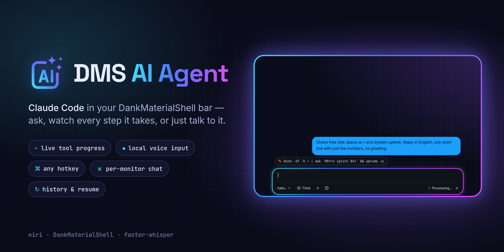
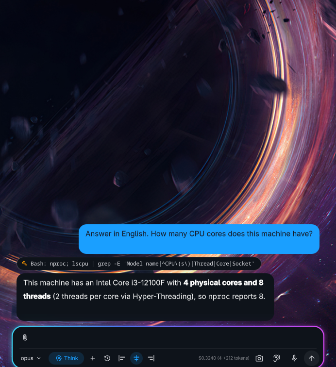
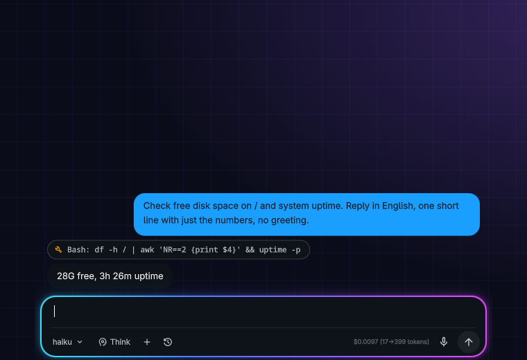

<p align="center">
  
</p>

<p align="center">
  <a href="LICENSE"></a>
  
  
  <a href="https://github.com/Francisdelca/dms-agent"></a>
</p>

**DMS AI Agent** is a desktop assistant for [DankMaterialShell](https://danklinux.com) powered by
[Claude Code](https://docs.claude.com/en/docs/claude-code). Click the pill in your bar (or hit a
hotkey), type or say what you need — "open Telegram on workspace 2", "how much disk space is left",
"find the PDFs I downloaded today" — and watch the agent do it, step by step.

It is a fork of [Francisdelca/dms-agent](https://github.com/Francisdelca/dms-agent) that fixes a few
bugs and adds the things that were missing for daily use. The fork merges the original every day,
so improvements made there arrive here too.

## What's different from the original

| | Original | This fork |
|---|---|---|
| While the agent works | only "Processing..." | every tool call appears in the chat as it happens |
| Cancel | hid the request, Claude kept running in the background | really stops the agent |
| History | always empty (path hardcoded to the author's home) | lists and resumes your agent chats |
| Monitors | chat always opened on the first monitor | a pill on every bar, chat opens where you clicked |
| Hotkey | manual edit of the niri config | set in plugin settings, opens on the focused monitor |
| Voice | — | mic button, local Whisper (GPU or CPU), nothing leaves your machine |
| Transcribing others | — | a second button listens to the speakers, for the far side of a call your mic cannot hear |
| Replies | plain labels: nothing could be selected or copied | select with the mouse, or copy a whole reply as markdown or as plain text |
| Chat position | always bottom-centre | left edge, centre or right edge, remembered per monitor |
| Look | grey border | neon gradient rim, custom icon and label |
| Sessions | mixed with your other Claude Code sessions in `$HOME` | kept in their own project dir |

<p align="center">
  
  
</p>

## Requirements

- [DankMaterialShell](https://danklinux.com) ≥ 1.4 on **niri** (the chat itself also works on other
  compositors; the hotkey helper and "open on the focused monitor" need niri)
- [Claude Code](https://docs.claude.com/en/docs/claude-code) CLI, logged in (`claude` in `PATH`)
- `git`, `python3`, `notify-send`
- Voice input: PipeWire (`pw-record`) and ~0.5–2 GB of disk for the Whisper model;
  an NVIDIA GPU makes it near-instant but is not required

## Install

```bash
curl -fsSL https://raw.githubusercontent.com/Cha1000000/dms-ai-agent/main/install.sh | bash
```

or from a checkout:

```bash
git clone https://github.com/Cha1000000/dms-ai-agent
cd dms-ai-agent && ./install.sh
```

The installer puts the plugin into `~/.config/DankMaterialShell/plugins/dmsAgent` (an existing copy
of the original plugin is moved aside, not deleted), creates a Python venv for voice input with the
CUDA libraries when an NVIDIA GPU is present, downloads the Whisper model, sets the hotkey and
restarts DMS. It tells you exactly which package to install if something is missing, and is safe to
run again to update.

| Option | Meaning |
|---|---|
| `--hotkey KEY` | chat hotkey, default `Mod+Space`; `none` to skip |
| `--no-voice` | skip the voice input setup |
| `--voice-venv PATH` | reuse an existing venv that already has `faster-whisper` |
| `--no-model` | don't pre-download the Whisper model (it downloads on first use) |

Then, in DMS:

1. **Settings → Plugins** → enable **DMS AI Agent**
2. **Settings → Bar** → add the **DMS AI Agent** widget to each bar where you want the pill

## Settings

**Settings → Plugins → DMS AI Agent**

| Setting | Default | |
|---|---|---|
| Model | `haiku` | `haiku` (fast), `sonnet`, `opus` |
| Extended Thinking | off | deeper reasoning, slower |
| System Prompt | built-in | your own instructions for the agent |
| Pill Label | `Jarvis` | text next to the icon in the bar |
| Chat Hotkey (niri) | `Mod+Space` | any niri key combo; empty removes it |
| Message Text Size | `13px` | font size in the chat bubbles, 11–22 |
| Whisper Model | `Auto` | `large-v3-turbo` on an NVIDIA GPU, `small` on CPU |
| Microphone | System default | dropdown of the capture devices PipeWire knows, under the names the audio settings show |
| Language | `auto` | or a fixed code (`en`, `ru`, `de`, …) — more accurate for short phrases |
| Whisper venv | installer's | path to a venv with `faster-whisper` |

### Hotkey

niri binds live in the compositor config, so the plugin keeps its one binding in
`~/.config/niri/dms-ai-agent.kdl`, included at the very end of `config.kdl`:

```kdl
include optional=true "dms-ai-agent.kdl"
```

Later binds override earlier ones with the same key, so the agent wins over a DMS default on that
key. A new value from the settings is checked with `niri validate` before it replaces the file —
a typo never breaks your running config. On other compositors, bind
`dms ipc call dmsAgent toggle` yourself.

### Voice input

Click the mic, speak, click again: the text is inserted at the cursor so you can fix it before
sending. `Esc` cancels. Recording is capped at 2 minutes.

Speech is recognized locally by [faster-whisper](https://github.com/SYSTRAN/faster-whisper). The
model is loaded by a small background server on first use and unloaded after 10 idle minutes, so
the first phrase takes a couple of seconds and the next ones are near-instant. Logs:
`$XDG_RUNTIME_DIR/dms-agent-voice.log`.

### Transcribing what you hear

The button left of the mic records the **output** instead of the microphone —
whatever is playing on your speakers or headphones — and drops the transcript into the
input box the same way. It is meant for the other side of a call: in headphones your
microphone cannot hear them at all, and over speakers it hears them badly.

It attaches to the monitor of the current output, so switching from speakers to
headphones needs no configuration. Two caveats: everything playing is captured, notifications
and music included, and several speakers come out as one undivided block of text.
Your own voice is not in there — it goes to the microphone, not to the output.

Both buttons drive the same single recording, so while one is running the other is dimmed.

### Copying a reply

Message text is selectable: drag across it and press `Ctrl+C`, `Esc` clears the selection and puts
the cursor back in the input box. Hovering a bubble also reveals two buttons in its corner — **md**
copies what the agent actually sent, headings, bold and fenced code intact, and **Text** copies the
same without any markup. Your own messages get a single button.

### Where the chat opens

The three buttons next to *history* pin the chat to the **left edge**, the **centre** or the
**right edge** of the monitor. The open window moves as you press them, and the choice is kept for
each monitor separately — handy when one screen is wide and another is portrait.

## Updating

Use **Update** in DMS (Settings → Plugins) or re-run `install.sh`. DMS updates plugins with
`git pull`, and this repository only ever moves forward, so updates are plain fast-forwards.

If the chat still behaves like the old version afterwards, restart the shell —
`systemctl --user restart dms.service`. Reloading the plugin alone refreshes the bar widget while
the chat panel stays in memory with the QML it was built from.

### Upstream sync

A [workflow](.github/workflows/sync-upstream.yml) merges
[Francisdelca/dms-agent](https://github.com/Francisdelca/dms-agent) into `main` every day:

- **clean merge** → pushed right away, you get it with the next DMS update;
- **conflict** → nothing is pushed; an issue titled *Upstream sync: merge conflict* lists the files
  and the new upstream commits. Resolve it locally with
  [`scripts/sync-upstream.sh`](scripts/sync-upstream.sh), which leaves the conflict in your working
  tree. Rule of thumb: when upstream now contains the same fix, take theirs; keep ours for
  fork-only features. `git rerere` is enabled, so a resolution is reused if the same hunk
  conflicts again.

Merges, not rebases, are deliberate: a rewritten history would make every installed copy fall back
to deleting and re-cloning the plugin.

## Good to know

- The agent runs Claude Code with `--dangerously-skip-permissions`: it executes commands **without
  asking**. That is what makes "open X, move it to workspace 2" instant — keep it in mind.
- Agent sessions live in their own Claude Code project (working dir
  `~/.local/state/dms-agent`), separate from sessions you start in your home directory.
- The chat panel is shown on one monitor at a time; the hotkey toggles it on the focused one.

## Credits

Original plugin by **[Francis](https://github.com/Francisdelca)** —
[Francisdelca/dms-agent](https://github.com/Francisdelca/dms-agent). This fork is maintained by
[Vladimir Mileshko](https://github.com/Cha1000000). Much of the fork was written together with
Claude Code.

[MIT](LICENSE)
